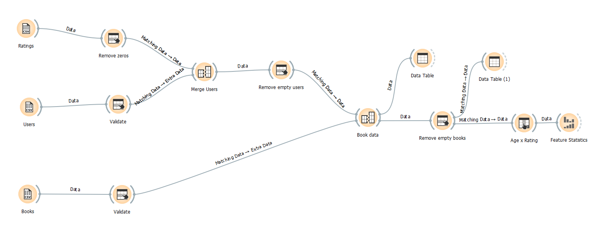
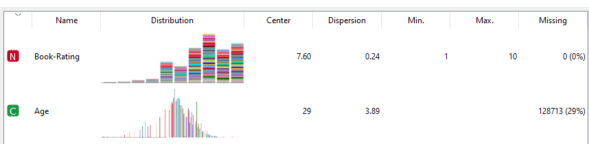

# Modelo Lógico de Tabelas com Orange/Kaggle

Nesta tarefa foi feita uma visualização dos dados do banco de dados _Book-Crossing: User review ratings_, analisando a nota dada aos livros, por idade da pessoa.

## Tarefa sobre Análise de Dados usando o Orange

